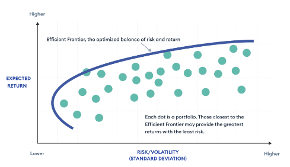
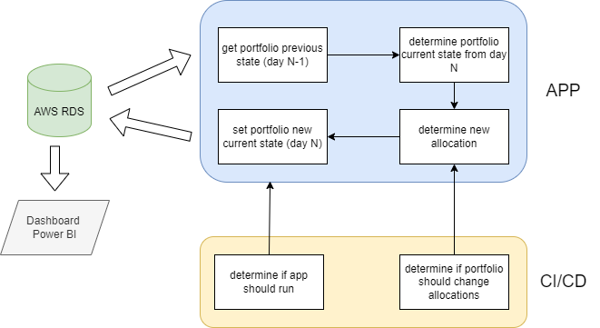
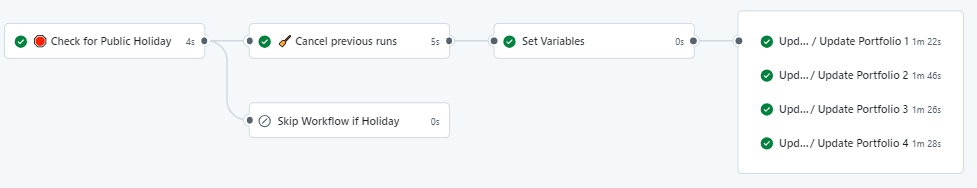
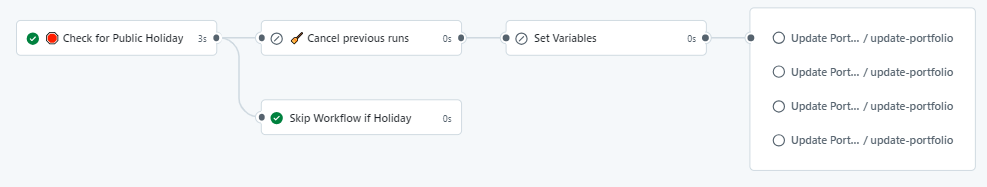

<div align="center">
    <h1>Build a trading algorithm and backtesting framework using  <a href="https://docs.github.com/en/actions/writing-workflows">Github Workflows</a> and <a href="https://aws.amazon.com/">AWS</a></h1>

</div>

#### Table of contents
* [Our goal 🎯](#our-goal)
* [Our hypotheses  ](#our-hypotheses)
* [Our system ](#our-system)
* [How to run the app locally? 🏃](#how-to-run-the-app-locally)
* [How to deploy the app? 🚀](#how-to-deploy-the-api-to-kubernetes-with-gimlet)
* [How to monitor our strategy using Power BI? 🔎](#how-to-monitor-our-strategy-with-power-bi)


## Our goal

This project started as a joke with my brother who bet on companies that will soar following 2024 Trump Election. So as I was wondering how his portfolio might perform, I questioned myself if i could beat his using some well-known mathematical techniques. Thus, I defined the following objectives :

- What will be his portfolio performance if no allocation is done ?
- What will be my portfolio performance if I frequently re-allocate my assets in an optimal way  ? Is there any impact on how frequent I should re-allocate them ?

## Our hypotheses
These are the following stocks he bet on :

	- NOC (Northrop Grum..)
	- LMT (Lockheed Martin)
	- LDOS (Leidos Holdings)
	- BAH (Booz Alien Hami…)
	- DFEN (Direxion Dly Aer…)
	- EOG (Eog Res Inc)
	- CVX (Chevron Corp)
	- XOM (Exxon Mobil)
	- GM (General Motors Co)
	- TSLA (Tesla Inc)
	- PHUN (Phunware Inc)
    - DJT (Trump Media & …)

The election happening on 5th november, we suppose that the bet was made after the presidential debates and stocks were bought the next Monday following these debates i.e. 7th October 

## Our system
The analysis was made on 4 portfolios :
- his portfolio named *portfolio LAN*
- my daily-updated portfolio named *portfolio ED daily*
- my weekly-updated portfolio named *portfolio ED weekly*
- my monthly-updated portfolio named *portfolio ED monthly*

We decided to use Markwotiz theory to allocate my portfolio. The theory is described by a set of statistical procedures to determine the allocation that maximizes the portfolio's expected return and minimizes its associated risk. It is defined under the framework of a risk-return tradeoff graph. 


The trading system is defined as follows :



**NB: In the future, we will use other techniques based on stock prices, market sentiment or companies fundamentals**

## How to run the app locally?

Git clone this repository, cd into the root directory of the project and then run the following commands using make.

1. Install [Python Poetry](https://python-poetry.org/docs/#installation) (if necessary)
and create an isolated virtual environmnet for development purposes.
    ```
    $ make install-win
    ```

2. run one-time the app (check if your variables are set) 
    ```
    $ make run-one-uc
    ```

3. Test and run one-time the app 
    ```
    $ make all
    ```
Great ! your app runs locally. 

## How to deploy the app ?

The idea here is that your portfolios status are updated automatically using Github Workflows. 

If the current day is an open market day, then the app makes the portfolios checks and updates. Otherwise, it is not called.


*case 1: the app is running*


*case 2: the app is not called*

When the app is running, we define which portfolio should be updated. The trigger is passed down through the job "Set variables". Then, each portfolio status using database info connection and its respective id is updated.

**NB :** To get more details on the workflow:  
- check the *main.yml* and *portfolio_update.yml*
- ensure to set your secret environnement variables in the repo settings).


## How to monitor our strategy with power BI?
This part is still under construction as I'm building the dashboards locally before sharing them publicly. 

## Closing
Feel free to comment and add any constructive critics that could help me better my solution :)